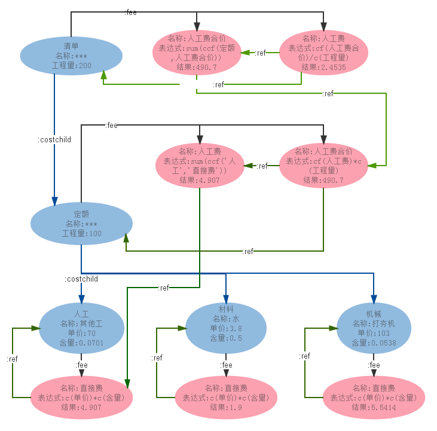

Loki
====
# 问题
## 模型

## 需求
响应用户对模型的操作，准确及时地维护模型、数据的一致。
## 示例

## 用例

# 选型
| *比较(10分制)* | *basex* | *neo4j* | *mongodb* | *mysql*|
|-------|---------|--------- |-----------|-------|
| 节点的树模型一致性 | 10 | 8 | 5 | 4|
| 费用计算依赖的有向图模型一致性 | 5 | 10 | 5 | 5|
| 前端json与后端模型一致性 | 5 | 8 | 10 |3 |
| 高可用性 | 5 | 8 | 10 |8 |
| 效率| | | | |

其他比较： http://db-engines.com/en/system/BaseX%3BMongoDB%3BNeo4j%3BMYSQL

# 建模
## basex
 
## neo4j

## mongodb

## mysql

# 优化
| *优化* | *basex* | *neo4j* | *mongodb* | *mysql*|
|-------|---------|--------- |-----------|-------|
|服务器调优| | | | |
|建模| | | | |
|索引| | | | |
|算法| | | | |

# 测试
| *测试* | *basex* | *neo4j* | *mongodb* | *mysql*|
|-------|---------|--------- |-----------|-------|

