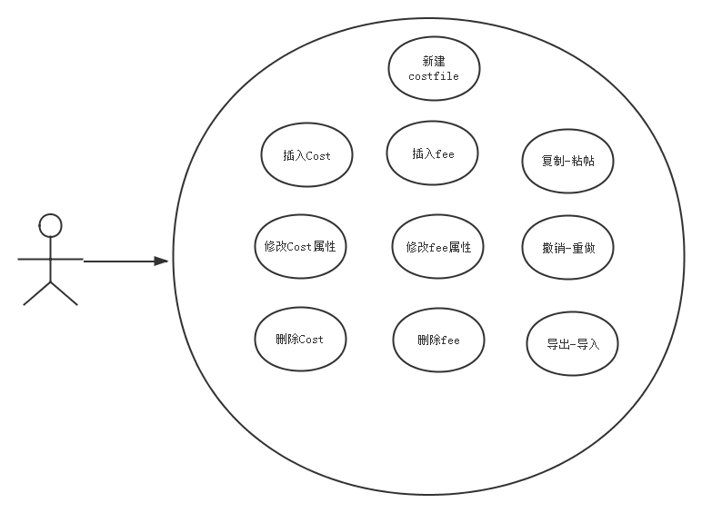

Loki
====
# 问题
## 模型

## 问题
响应用户对模型的操作，准确及时地维护模型、数据的一致。
## 示例

## 用例

# 选型
|| *比较* || *basex* || *neo4j* || *mongodb* ||
|| 树模型一致性 || 10 || 8 || 5 ||
|| 有向依赖关系一致性 || 5 || 10 || 5 ||
|| json模型一致性 || 5 || 8 || 10 ||
|| 高可用性 || 5 || 8 || 10 ||

# 优化

# 测试

